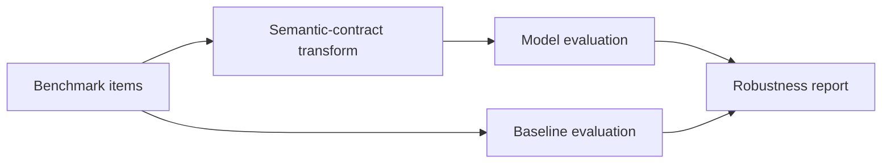

# Architecture

```mermaid
flowchart LR
  A[Benchmark items] --> B[Semantic-contract transform]
  B --> C[Model evaluation]
  A --> D[Baseline evaluation]
  C --> E[Robustness report]
  D --> E
```

Every perturbation must preserve an explicit invariant. For answer reordering, the invariant is the text of the correct answer; only its displayed position changes.
